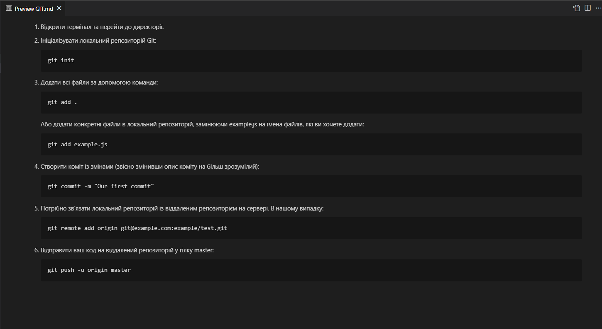
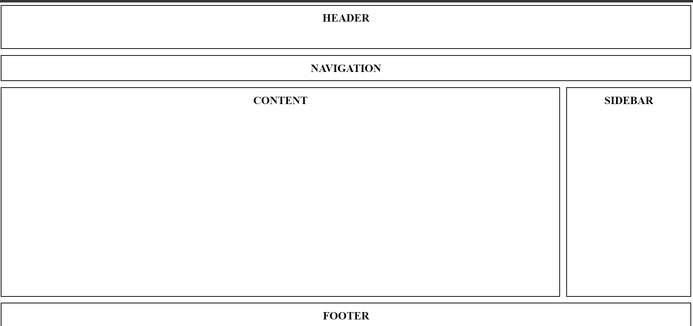
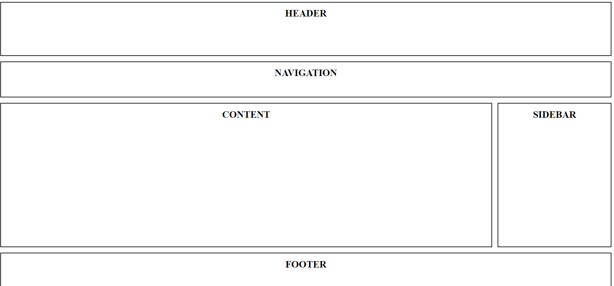
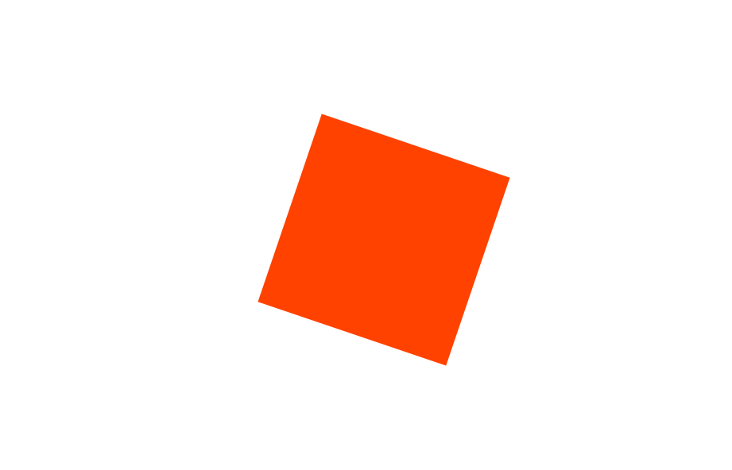
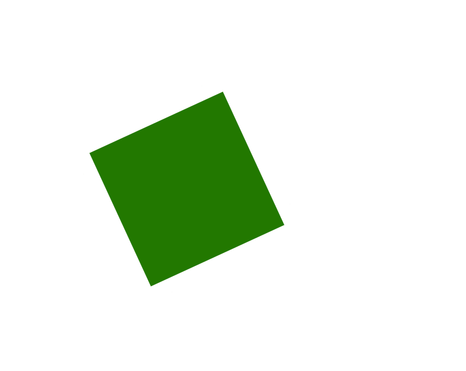

# Test_Task_DevIT
Посилання: https://cloud.devit.group/s/PgiakbTLHFdBddo

Cтруктуру проекту, яка складається з трьох головних каталогів: html_css, git та js. Кожен з цих каталогів містить підкаталоги та файли. Ось структура проекту:

```
├───git
│       GIT.md
│
├───html_css
│   ├───flex_layout
│   │       index.html
│   │       styles.css
│   │
│   ├───grid_layout
│   │       index.html
│   │       styles.css
│   │
│   └───square
│           index.html
│           styles.css
│
└───js
        task_1.ts
        task_2.ts
        task_3.ts
        task_4.ts
        task_5.ts
        task_6.ts
        task_7.ts
        task_8.ts
        task_9.ts
        types.ts

```
- <b>git</b>:  Цей каталог містить файл, пов'язану з "Git" завданням. Файл GIT.md містити опис подальших дії, щоб код з'явився у гілці master в репозиторії git@example.com:example/test.git.
- <b>html_css</b>: Цей каталог містить файли та підкаталоги, пов'язані з "CSS, HTML" завданням. У ньому є підкаталоги flex_layout та grid_layout, кожен з яких містить файли index.html та styles.css. Також є підкаталог square із відповідними файлами index.html та styles.css.
- <b>js</b>: Цей каталог містить файли, пов'язані з "JS логика" завданням. Він містить файли завдань (наприклад, task_1.ts, task_2.ts, і так далі) і файл types.ts, який містить, типи для TypeScript.

### Завдання GIT 
  
  
### Layout Flexbox 
  
  
### Layout Grid 
  

### Створіть анімацію "Квадрат по центру вікна, обертається навколо своєї осі та змінює колір із червоного на помаранчевий, потім на зелений"
  
  
  
